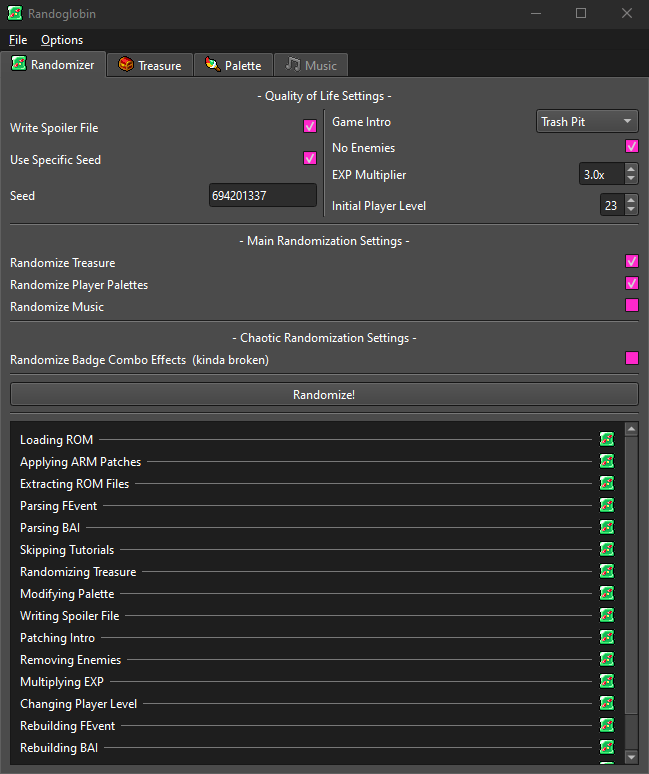

# Randoglobin
Randoglobin is a randomizer for Mario and Luigi: Bowser's Inside Story.



This program is still in development, and will see far more features in the future.

# Credits
[ThePurpleAnon](https://bsky.app/profile/thepurpleanon.bsky.social) - Python Code / UI Design

[DimiDimit](https://github.com/DimiDimit) - Additional Code and Patches / [`mnllib.py`](https://github.com/MnL-Modding/mnllib.py) & [`.rs`](https://github.com/MnL-Modding/mnllib.rs)

[MiiK](https://bsky.app/profile/miikheaven.bsky.social) - Randoglobin Icon / Additional Graphics

Translators:
- Español  - [AngelThe_M](https://bsky.app/profile/angelthem.bsky.social)

# Running the Program
There are 4 ways to run this program, from easiest to most complicated:

1. Download the binary from [Releases](https://github.com/MnL-Modding/Randoglobin/releases) and run it. (Use the `.exe` for Windows, and the `.bin` for Linux)

2. Install the package with
```bash
python3 -m pip install --force-reinstall git+https://github.com/MnL-Modding/Randoglobin
```
and run it with `randoglobin` or `python3 -m randoglobin`.

3. Clone the repository, install the dependencies with Poetry (assuming you already have Poetry installed with `python3 -m pip install poetry`):
```bash
poetry install
```
and run the program through Poetry:
```bash
poetry run randoglobin
```

4. Clone the repository, install the dependencies through `pip` with:
```bash
python3 -m pip install -r requirements.txt
```
and run it from the current directory with `python3 -m randoglobin`. Alternatively, it can be run through the `run.bat` if you use Windows.
